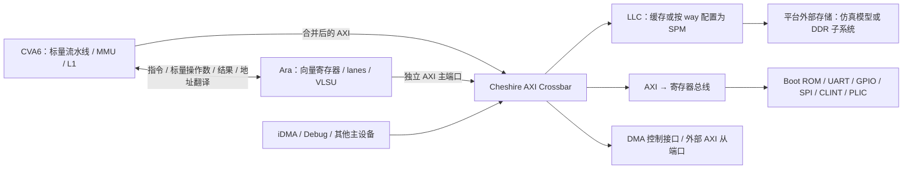
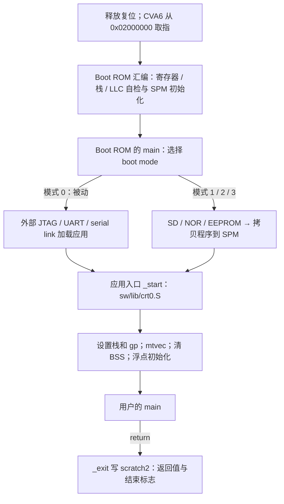

# Cheshire-Ara 源码入门：从 SoC 顶层到裸机程序

> 2026-09-20 软件专题：SDK、交叉工具链、编译链接、嵌入式库与测试程序流程，集中见[软件学习手册](software/README.md)；硬件参数见[配置手册](configuration/README.md)。两套手册均区分当前源码事实与未执行的使用示例。

> 2026-09-20 方向更新：新 Agent 先读 [项目共享状态](PROJECT_STATE.md) 和 [任务分工](AGENT_TASKS.md)，再按需查阅本教程。DDR 供应商已可提供 AXI4，本文第 11.2 节的 AXI3 转换规划不再是当前必选项；独立 ASIC 提取按 [02 交接书](02_Cheshire_Ara_ASIC_Extraction_Handoff.md) 执行，新目录不长期依赖 Bender。本文旧命令和工作区描述属于参考快照，不表示已经修正或重新验收。

> 2026-09-16 更新：`.bender/git/checkouts/` 的依赖源码和本地修改已随主仓库保存，使用根 `Bender.local` 的相对路径解析。参阅[快照说明](../.bender/README.md)了解排除项；不要删除 `.bender`。本文其余分析保留编写时的源码和实测边界。

## 阅读约定

本文针对本地 `mp/ara-pulp-v2` 工程；版本、修改状态和阅读范围见 [00_README](00_README.md)。除特别标注外，实现描述均来自当前源码。命令供后续复现使用，本轮没有执行构建、仿真或烧录。

建议第一次依次阅读第 1～8 节，先建立“硬件配置—程序地址—启动—输出”的完整概念，再读向量及扩展部分。

常用术语先约定：RTL 是寄存器传输级硬件描述；FPGA 是现场可编程门阵列；ASIC 是专用集成电路。ISA 是指令集架构；SRAM 是静态随机存储器，ROM 是只读存储器，DDR 是双倍数据率动态存储器接口，PHY 是物理接口层。

外设缩写：UART 为通用异步串口，SPI 为串行外设接口，I2C 为双线串行总线，GPIO 为通用输入输出，JTAG 在本工程用于串行调试访问，APB 为低复杂度外设总线。后文按实际连接解释它们，不要求先读完所有协议。

本文使用以下依赖路径简称；这些不是新增目录或要求设置的环境变量：

| 简称 | 本次实际目录 | 迁移后定位方法 |
| --- | --- | --- |
| `CVA6_DIR` | [.bender/git/checkouts/cva6-20c9d7cbe0dd6995](../.bender/git/checkouts/cva6-20c9d7cbe0dd6995) | `bender path cva6` |
| `ARA_DIR` | [.bender/git/checkouts/ara-2c7b103275a16c87](../.bender/git/checkouts/ara-2c7b103275a16c87) | `bender path ara` |
| `AXI_DIR` | [.bender/git/checkouts/axi-ecdc900686449c15](../.bender/git/checkouts/axi-ecdc900686449c15) | `bender path axi` |
| `LLC_DIR` | [.bender/git/checkouts/axi_llc-5fb8850caad4fcfa](../.bender/git/checkouts/axi_llc-5fb8850caad4fcfa) | `bender path axi_llc` |

依赖目录尾部标识不应成为团队脚本的永久接口；应使用 Bender 查询路径并保留锁文件。读取已存在的依赖和首次联网 checkout 是不同操作。

## 1. Cheshire、CVA6、Ara 分别是什么

### 1.1 从一条指令和一次访存理解分工

CPU 执行指令需要取指、寄存器、执行单元、异常处理和访存；但仅有 CPU 还不能从串口打印。它还需要可访问的存储、地址解码、UART、时钟复位、程序加载方法以及软件启动代码。

- **CVA6** 提供标量处理器：程序计数器（PC）、取指/译码/执行、整数和浮点寄存器、控制状态寄存器（CSR）、异常及特权态、内存管理单元（MMU）和一级缓存（L1）。当前 RV64 配置属于 CVA6 的六级、顺序发射体系；“顺序”不意味着所有功能单元都单周期或没有并发事务。
- **Ara** 提供 RISC-V 向量扩展（RVV）的执行资源。它由 CVA6 发来的指令驱动，拥有向量寄存器与向量运算/访存单元，不是另一个独立取指启动的 CPU。
- **Cheshire** 把处理器、加速器接口、AXI 互联、末级缓存（LLC）、片上暂存存储器（SPM）、外设、中断、调试和启动机制接起来，并提供软件与平台封装。

AXI（Advanced eXtensible Interface）是一组分离读写地址、数据和响应的总线通道。主设备主动发起访问，从设备响应访问；这与软件中的“主程序/子程序”没有关系。



图中是功能关系，不代表所有节点在每个配置都启用。Ara 的实际实例嵌在 `cheshire_soc` 的每核 generate 块中，不能因此直接推断该分支支持任意数量的 CVA6+Ara 对。

源码入口：[hw/cheshire_soc.sv](../hw/cheshire_soc.sv) 的 `module cheshire_soc`、`i_axi_xbar`、`gen_cva6_cores`、`gen_ara`；[hw/cheshire_pkg.sv](../hw/cheshire_pkg.sv) 的配置和地址生成函数。六级、单发射的概括来自本地 [CVA6 README](../.bender/git/checkouts/cva6-20c9d7cbe0dd6995/README.md)，具体接口和功能则以本次所选 profile 为准。

### 1.2 三个必须区分的顶层

| 场景 | 顶层及位置 | 职责 |
| --- | --- | --- |
| 通用 SoC | `cheshire_soc`，`hw/cheshire_soc.sv` | 可复用的 SoC 集成；外部暴露时钟、复位、DDR 方向 AXI、扩展端口和外设信号 |
| 系统仿真 | `tb_cheshire_soc`，`target/sim/src/tb_cheshire_soc.sv` | 选择测试配置、启动模式和程序，等待测试结束 |
| VCU118 FPGA | `cheshire_top_xilinx`，`target/xilinx/src/cheshire_top_xilinx.sv` | 板级引脚、时钟、复位、Xilinx DDR、调试和 SoC 参数 |

仿真层次是 `tb_cheshire_soc → fix:fixture_cheshire_soc → dut:cheshire_soc`。`fix.vip` 提供时钟、复位、串口/JTAG 行为与外部存储模型。

依赖 Ara 目录还包含独立的 `ara_soc` 等模块，但它们不是当前 Cheshire 系统仿真的顶层。现有 Vivado 工程某个 simulation fileset 的 `TopModule=ara_soc` 也不能代替上述判断；综合顶层和测试平台顶层必须分别核对。

## 2. 工程目录：哪些要读，哪些不能带进 ASIC

| 目录／文件 | 功能 | 是否进入硬件综合 | ASIC 处理 | 入门优先级 |
| --- | --- | --- | --- | --- |
| `Makefile`、`cheshire.mk` | 组织生成、软件和平台任务 | 否 | 保留流程思想，固定工具及生成结果 | 高 |
| `Bender.yml`、`Bender.lock` | 依赖、源文件顺序、条件选择 | 不直接进入 | 必须保留可追溯性 | 高 |
| `hw/cheshire_soc.sv`、`hw/cheshire_pkg.sv` | 通用集成、配置、地址规则 | 是 | 主要复用对象 | 最高 |
| `hw/include/cheshire/` | AXI/寄存器等类型定义宏 | 随 RTL 展开 | 接口位宽变化时同步审查 | 高 |
| `hw/regs/` | HJSON 寄存器描述及生成 RTL | 生成后的 RTL 是 | 生成源和产物都要纳入基线 | 高 |
| `hw/bootrom/` | ROM 的 C/汇编、链接、生成镜像及 RTL | ROM RTL 是 | 内容冻结；按工艺实现 ROM | 高 |
| `hw/cheshire_idma_wrap.sv` | iDMA 前后端集成 | 是 | 验证后复用 | 中 |
| `hw/future/` | USB 等实现 | 取决于配置 | 目录名不代表已通过 ASIC 验证 | 低 |
| `.bender/git/checkouts/` | CPU、Ara、AXI、LLC、外设等依赖 | 选中的 RTL 是 | 定向复用；SRAM/工艺单元需要映射 | 高，按调用关系读 |
| `sw/include/`、`sw/lib/` | 板级支持、硬件抽象层及最小运行时 | 否 | 软件仍需保留和适配 | 最高 |
| `sw/link/`、`sw/boot/` | 地址布局、链接脚本、零级加载器（ZSL） | 否 | 随新存储与启动方案更新 | 高 |
| `sw/tests/` | 裸机与本地向量测试及已有产物 | 否 | 可作为验证输入，逐项审核判据 | 高 |
| `sw/tests_wo_ara/` | 本地额外测试目录 | 否 | 当前 `sw-all` 不自动扫描它 | 按需 |
| `sw/deps/` | printf、CVA6 SDK 等软件依赖 | 否 | 不是 RTL IP 目录 | 中 |
| `target/sim/` | TB、验证环境（VIP）、ELF 加载器、外设模型 | 否 | 保留验证，不综合 | 最高 |
| `target/xilinx/src/` | FPGA shell、DDR 封装和原语 | FPGA 使用 | PAD、PLL、DDR PHY 等须替换 | 高 |
| `target/xilinx/scripts/`、`constraints/` | Vivado IP/工程生成和板级约束 | 否 | 不能直接当 ASIC 约束使用 | 中 |
| `target/xilinx/build_ara/`、`out_ara/` | 本地已有工程、报告、bitstream | 产物 | 只能作为历史证据 | 中 |
| `util/`、`docs/` | 工具入口与现有说明 | 否 | 查清版本差异后复用 | 中 |

没有发现当前根工程自带完整的 ASIC 签核流程。`cheshire.mk` 有可选 `nonfree` 接口，不表示本地已具备相应授权、文件和工具环境。

## 3. 配置系统：SoC 参数和编译文件选择必须一起看

### 3.1 不是修改一个配置文件就结束

当前链路分为三部分：

```text
Bender targets / defines → 选择 CVA6 profile 和源文件 → 编译 package/module
cheshire_cfg_t + wrapper 配置 → 生成端口索引、地址规则及类型 → RTL 展开
HJSON + 生成脚本 → 寄存器 RTL / C 头文件 → 分别参与硬件和软件构建
```

“生成”有两种含义：`gen_axi_out()` 等是 SystemVerilog 常量函数，在编译/展开时计算；`regtool.py` 等才是运行外部脚本生成文件。不要混为同一种流程。

入口：[hw/cheshire_pkg.sv](../hw/cheshire_pkg.sv) 的 `cheshire_cfg_t`、`DefaultCfg`、`gen_cva6_cfg`、`gen_axi_in`、`gen_axi_out`、`gen_reg_out`；[cheshire.mk](../cheshire.mk) 的 `CHS_BENDER_RTL_FLAGS`。

### 3.2 当前几种配置的实际区别

| 项目 | 根 Makefile 默认 CVA6 profile | Ara 集成 Makefile 使用的 CVA6 profile |
| --- | --- | --- |
| Bender target | `cv64a6_imafdchsclic_sv39_wb` | `cv64a6_imafdcv_sv39` |
| 配置文件（均在 `CVA6_DIR/core/include/`） | `cv64a6_imafdchsclic_sv39_wb_config_pkg.sv` | `cv64a6_imafdcv_sv39_config_pkg.sv` |
| XLEN，整数寄存器宽度 | 64 | 64 |
| RVV / RVH（向量／虚拟化扩展） | 0 / 1 | 1 / 0 |
| L1 指令缓存 | 16 KiB，4 路 | 4 KiB，4 路 |
| L1 数据缓存 | 32 KiB，8 路，写回（WB） | 8 KiB，4 路，写穿（WT） |
| 数据缓存行宽 | 128 bit | 256 bit |

这不是只差一个 `V`。缓存组织和行为也改变，不能把某一配置的测量结果直接归到另一配置。

[target/sim/src/tb_cheshire_pkg.sv](../target/sim/src/tb_cheshire_pkg.sv) 的 `TbCheshireConfigs` 提供 `0=默认`、`1=AXI RT`、`2=CLIC`、`3=Ara`。Ara 配置设置 `Ara=1`、`AraNrLanes=2`、`AraVLEN=2048`。CLIC 是可选的核本地中断控制器，AXI RT 是可选的总线实时调节单元；配置 3 不自动启用它们。

`gen_cva6_cfg()` 从已经选中的 `cva6_config_pkg::cva6_cfg` 出发，覆盖地址、位宽和部分平台选项，**并不会根据 `Cfg.Ara` 自动打开 RVV**。CVA6 的 `EnableAccelerator` 又由 RVV 配置派生。因此必须同时选择向量 profile 和实例化 Ara 的 SoC 配置。

本次读取到的生成文件状态：

- `target/sim/vsim/compile.cheshire_soc.tcl` 和 VCS 同名编译脚本使用标量 WB profile，同时列入 CVA6 的 `cva6_accel_first_pass_decoder_stub.sv` 与 Ara 的 `cva6_accel_first_pass_decoder.sv`。两者定义同名模块，是需要消除的文件选择风险；具体工具报错或覆盖行为本轮未验证。
- `target/xilinx/scripts/add_sources.vcu118.tcl` 使用向量 profile，定义 `ARA`、`NR_LANES=2`、`VLEN=2048`，没有列入该 stub。
- 单独在启动仿真时设置 `SELCFG=3`，不会重编译这些文件。

Ara 集成的原始命令来源：[ARA_DIR/cheshire/Makefile](../.bender/git/checkouts/ara-2c7b103275a16c87/cheshire/Makefile) 的 `COMMON_CUSTOM_TARGETS`、`update_vsim_src` 和 `update_xilinx_src`。关键 target `exclude_first_pass_decoder` 用来排除 CVA6 stub。

### 3.3 想改什么，应从哪里入手

| 修改意图 | 主要入口 | 必须一起检查 |
| --- | --- | --- |
| CPU 数量 | `cheshire_cfg_t.NumCores` | CLINT/PLIC 生成参数、hart/debug、中断布局、启动软件；本分支 Ara 多核连线需另行设计审查 |
| 打开/关闭 UART、SPI、GPIO 等 | `Uart`、`SpiHost`、`Gpio` 等字段 | Boot ROM 使用、地址规则、引脚、软件和设备树 |
| LLC/SPM 容量 | `LlcNotBypass`、`LlcSetAssoc`、`LlcNumLines`、`LlcNumBlocks`、`AxiDataWidth` | Boot ROM、栈、地址区间、软件链接长度、SRAM 实现 |
| DRAM 地址范围 | `LlcOutConnect`、`LlcOutRegionStart/End` | 外部实际容量、控制器映射、链接脚本、设备树 |
| Boot address | `AmBrom`、`PlatformRom`、顶层 `boot_addr_i` 接线 | ROM 解码和链接；不是仅修改应用 `_start` |
| Ara 开关、lanes、VLEN | 仿真配置包或 FPGA `gen_cheshire_xilinx_cfg`；匹配 Bender profile/defines | Ara 配置、AXI 位宽、软件 `-march`、向量状态及回归 |
| 外部 AXI 主设备 | `AxiExtNumMst` | 总线 ID 扩展、仲裁、连接和带宽 |
| 外部 AXI 从设备 | `AxiExtNumSlv`、`AxiExtNumRules`、`AxiExtRegion*` | 区间不重叠、从设备端口索引和软件地址 |
| 外部寄存器从设备 | `RegExtNumSlv`、`RegExtNumRules`、`RegExtRegion*` | 顶层 reg 端口、32 位寄存器宽度和解码 |
| 外部中断 | `NumExtInIntrs` 等、`intr_ext_i` | PLIC/CLIC 源数、同步、编号和软件处理 |
| L1 cache / ISA | 选中的 CVA6 profile | 不能用 LLC 参数替代；指令集、缓存行为和 ABI 要同步 |

注意名称碰撞：`CVA6Cfg.VLEN=64` 表示该配置中的虚拟地址宽度，不是 Ara 向量寄存器长度；`Cfg.AraVLEN=2048` 才是本配置的向量寄存器位数。Sv39 是所选地址翻译模式，不能据此把上述两个 VLEN 混用。

`DefaultCfg.NumCores=1`。目前 Ara 请求/响应和 AXI 信号部分在核 generate 外共享，且只有一个 `AxiIn.ara` 索引；因此“把 NumCores 改成 2 就获得两个独立 Ara”不成立，至少需要专门检查多驱动与仲裁。

## 4. 第一次复现：理解构建任务而不是直接 make all

### 4.1 工具与工作区检查

以下命令在工程根目录运行，只用于识别当前环境：

```sh
pwd
git status --short
git rev-parse HEAD
bender --version
bender path cva6
bender path ara
command -v riscv64-unknown-elf-gcc
riscv64-unknown-elf-gcc --version
command -v vsim
command -v vcs
command -v vivado
```

本轮实际查询到 Bender 0.31.0、RISC-V GCC 15.2.0；PATH 中有 Questa 的 `vsim`，没有 `vcs`；Vivado 的 PATH 指向 2021.1，而已有 FPGA 报告记录的是 2022.1。这不是一套已验证一致的重建环境。

本地安装说明在 [docs/gs.md](../docs/gs.md) 和 [requirements.txt](../requirements.txt)。当前 checkout 使用它自己的 Python 依赖列表，不能直接照搬[官方最新 Getting Started](https://pulp-platform.github.io/cheshire/gs/)中已经变化的安装方法。

首次迁移缺失依赖时，构建可能自动执行 Bender checkout 和 printf 子模块初始化；入口是 `.bender/.chs_deps` 规则。离线服务器需要事先准备依赖和软件子模块。不要只复制 `hw/`，也不要对有本地改动的 `.bender/` 随意运行 `clean-deps`。

### 4.2 各 target 真正做什么

| 命令／target | 当前规则的含义 | 不包含什么 |
| --- | --- | --- |
| `make hw-all` | 生成寄存器 RTL，以及 CLINT、PLIC/OpenTitan 外设、AXI RT、VGA、serial link 和 iDMA 所需文件 | 不运行 CPU 仿真，不综合 FPGA |
| `make sw/tests/helloworld.spm.elf` | 生成软件头文件、对象和库，按 SPM 链接应用 | 不把程序写入硬件 |
| `make sw-all` | 构建库、工具及 `sw/tests/` 下匹配的全部测试与镜像 | 不等于只构建 Hello World |
| `make sim-all` | 生成 Questa/VCS 编译脚本，准备 SPI NOR 和 I2C 外部模型 | 不启动模拟器；不意味着 VCS 版本兼容 |
| `make all` | 上述 hw/sw/sim 任务的组合 | 不重建 Boot ROM、不构建 Linux SDK、不生成 bitstream |
| `make bootrom-all` | 重新编译 ROM 软件并生成 ROM RTL、反汇编等 | 不是日常编译应用的必要步骤 |
| `make chs-xilinx-vcu118` | 依赖就绪后创建 IP、综合、实现并导出 FPGA bitstream | 不自动加载应用 ELF |

来源：[Makefile](../Makefile)、[cheshire.mk](../cheshire.mk)、[sw/sw.mk](../sw/sw.mk)、[target/xilinx/xilinx.mk](../target/xilinx/xilinx.mk)。根 Makefile 为 `chs-*` 任务提供去掉前缀的别名。

ROM 没有纳入 `all` 是刻意安排：源码注释指出其可重复生成依赖特定编译器。先使用当前 ROM 基线；不要为了编译一个 C 测试把复位启动代码一起换掉。

当前 `sw/tests/` 含向量和其他本地测试，而默认软件 `-march` 不含 V；直接 `make all` 可能首先在软件测试处失败。`ARA_DIR/cheshire/Makefile` 的 `ara-chs-all` 又是先执行根 `all` 再更新仿真脚本，并不能自动解决此问题。

### 4.3 对齐当前 Ara 仿真文件选择

以下是根据现有 Ara 集成 Makefile 整理的分步命令，供在**已保存工作区、工具和依赖已准备好的复现副本**中执行；本轮没有执行。后续仿真示例统一使用该向量硬件配置。

```sh
# 工程根目录；变量只在当前 shell 使用。
CHS_ROOT_DIR="$PWD"
CHS_ARA_RTL_FLAGS='-t cv64a6_imafdcv_sv39 -t cva6 -t rtl -t exclude_first_pass_decoder --define ARA --define NR_LANES=2 --define VLEN=2048'

# 生成 RTL 依赖，不运行仿真。
make hw-all

# 强制重新生成两种仿真源文件脚本，避免保留另一配置的旧脚本。
make -B \
  "$CHS_ROOT_DIR/target/sim/vsim/compile.cheshire_soc.tcl" \
  "$CHS_ROOT_DIR/target/sim/vcs/compile.cheshire_soc.sh" \
  CHS_BENDER_RTL_FLAGS="$CHS_ARA_RTL_FLAGS"

# 准备仿真外设模型；缺失时可能联网下载，并涉及模型的许可条款。
make sim-all CHS_BENDER_RTL_FLAGS="$CHS_ARA_RTL_FLAGS"

# 只构建最小应用，避免首次就构建所有本地向量测试。
make sw/tests/helloworld.spm.elf
```

为什么显式使用绝对 target？`cheshire.mk` 用 `$(CHS_ROOT)/target/...` 定义生成脚本目标。为什么需要 `-B`？脚本规则主要依赖 `Bender.yml`，改变命令行变量不会自动让旧文件过期。这里限定到脚本 target，不建议对整个 `all` 无差别强制重建。

脚本重新生成后，用文本检查 profile、defines 和 decoder 文件，再重新编译仿真库。不要让同一个模拟器工作库混入旧配置。更改软件 flags 也不会自动重建旧 `.o` 和 `.a`；第一次建立可信基线需在复现副本中有计划地强制重建目标及其依赖，并检查编译日志。

## 5. 裸机软件：C 如何变成可执行程序

### 5.1 文件与工具链

```text
sw/tests/应用.c
  → RISC-V GCC → 应用.o
  → 链接脚本 + libcheshire.a（含 crt0 和驱动）→ ELF
  → 调试器/VIP 按 ELF 段加载，或 objcopy 转成 flash 所需镜像
  → SPM/DRAM 中的字节 → CVA6 取指执行
```

ELF 是携带入口、装载段和符号信息的可执行文件；裸 `.bin` 没有这些信息，加载者必须另行知道地址。仿真 JTAG 直接用 ELF，不需要先转 `.bin`。硬件 `.bit` 则是 FPGA 配置文件，与应用程序是两类东西。

[sw/sw.mk](../sw/sw.mk) 的默认编译配置包括：

| 选项 | 对当前工程的意义 |
| --- | --- |
| `riscv64-unknown-elf-gcc` | 无 Linux 运行时依赖的交叉编译器，由 `CHS_SW_GCC_BINROOT` 定位 |
| `-march=rv64gc_zifencei` | RV64 通用整数/乘除/原子/浮点、压缩指令及指令缓存同步；**不含向量 V** |
| `-mabi=lp64d` | 应用二进制接口（ABI）：64 位 long/指针，使用双精度硬浮点调用约定 |
| `-mcmodel=medany` | 适合当前链接地址范围的代码生成模型 |
| `-nostartfiles` | 不使用工具链默认启动文件；改由本工程 `crt0.S` 接管 |
| `-ffunction-sections -fdata-sections`、`--gc-sections` | 分离并删除未使用代码/数据 |
| `-flto` | 链接时优化（LTO）；库及对象必须与工具链匹配 |
| `-DOT_PLATFORM_RV32` | 所复用 OpenTitan 软件的条件宏，**不表示当前处理器是 RV32** |

`CHS_SW_CCFLAGS` 补充编译选项，`CHS_SW_LDFLAGS` 补充链接选项，`CHS_SW_INCLUDES` 提供头文件路径。`libcheshire.a` 包含启动汇编、硬件抽象层（HAL）、设备接口（DIF）、printf 和相关 IP 的软件库；它不是 Linux libc。

### 5.2 链接到 SPM、DRAM 和 ROM 的区别

| 输出 | 链接入口 | 程序运行地址 | 加载方式／注意事项 |
| --- | --- | --- | --- |
| `*.spm.elf` | [sw/link/spm.ld](../sw/link/spm.ld) | `0x10000000` 起 | 先初始化 LLC/SPM，再由 JTAG/UART 等加载；默认继承调用者栈 |
| `*.dram.elf` | [sw/link/dram.ld](../sw/link/dram.ld) | `0x80000000` 起 | 需要可工作的外部存储；设置 DRAM 栈 |
| `*.rom.elf` → `*.rom.bin` | [sw/link/rom.ld](../sw/link/rom.ld) | 运行在 SPM，镜像装载地址从外部介质偏移 0 开始 | 用于 Boot ROM 从介质拷贝；不能当普通 SPM ELF 喂给 JTAG loader |

[sw/link/common.ldh](../sw/link/common.ldh) 指定 `ENTRY(_start)`，并保守分配 SPM 64 KiB、DRAM 8 MiB。它们是当前软件布局限制，不是硬件实际总容量。SPM 可用硬件容量是 128 KiB，DRAM AXI 解码窗口是 2 GiB；三者不能混同。

VMA 是运行地址，LMA 是镜像装载地址。当前仿真 ELF loader 按 `PT_LOAD.p_paddr` 加载，所以 `.rom.elf` 中偏移 0 的镜像不应被当成程序要写到 SoC `0x00000000`；那个 SoC 区间属于 Debug。

### 5.3 Example 1：最小程序和“测试不结束”

以下为未来练习示例，**本轮未创建对应 `.c` 文件**：

```c
int main(void)
{
    while (1) {
    }
}
```

以后将它保存为 `sw/tests/empty.c`，可以按现有规则执行 `make sw/tests/empty.spm.elf`。这个文件名是示例新增文件，不是现有源码路径。

它适合观察 `_start`、`main` 和 PC，但不会返回结束码，默认 TB 会一直等待。仿真时应设观察时间或手动停止；需要自动测试时改成 `return 0;`，并通过退出寄存器检查结果。不要把“没有 UART 输出”判成程序未执行。

### 5.4 Example 2：UART Hello World

当前真实入口是 [sw/tests/helloworld.c](../sw/tests/helloworld.c)。它已经被本地修改：先设置 `mstatus.VS`，再测量频率、初始化 UART，最后用 printf 打印两个字符串。按当前源代码预期得到：

```text
Hello Cheshire SoC!
This is a formatted string. Decimal: 1024, Hex: 0x400
```

这不是本轮新运行的日志。此程序没有真正执行向量算术或向量访存，**不能用它证明 Ara 数据通路正确**。

理解输出链可以看这个仅用于文档的精简版本：

```c
#include <stdint.h>
#include "regs/cheshire.h"
#include "dif/clint.h"
#include "dif/uart.h"
#include "params.h"
#include "util.h"
#include "printf.h"

int main(void)
{
    uint32_t rtc = *reg32(&__base_regs, CHESHIRE_RTC_FREQ_REG_OFFSET);
    uint64_t hz = clint_get_core_freq(rtc, 2500);
    uart_init(&__base_uart, hz, __BOOT_BAUDRATE);
    printf("Hello Cheshire\r\n");
    uart_write_flush(&__base_uart);
    return 0;
}
```

实际链路为：`printf` 宏/库 → `_putchar` → `uart_write` → 写 UART MMIO → UART RTL 移位发送 → 仿真接收模型或板上 USB-UART。这里 MMIO 指内存映射输入输出，即用普通 load/store 访问外设寄存器。

[sw/lib/dif/uart.c](../sw/lib/dif/uart.c) 的 `uart_init()` 用 `freq/(baud*16)` 设置分频，配置 8 数据位、无校验、1 停止位，禁用 UART 中断并初始化 FIFO。`uart_write()` 轮询发送保持寄存器空标志再写字符，`uart_write_flush()` 执行 fence 并等移位器空。因此这条输出不依赖 PLIC 中断服务。

UART 基址 `0x03002000`；驱动中的 THR 偏移是 0，LSR 偏移是 `0x14`。当前寄存器间距为 4 字节，不要直接照搬字节连续排列的其他 UART 驱动。硬件路径在 `cheshire_soc.sv` 的寄存器总线到 APB UART 封装；底层来自 Bender 的 `apb_uart` 依赖。

`clint_get_core_freq()` 通过核心周期计数与 CLINT 的参考时间估计时钟，不是读取主机时间。CLINT 是核本地中断/定时器单元；`RtcFreq` 必须反映真实参考时钟，UART 才能正确设置波特率。

### 5.5 Example 3：安全地观察一个 MMIO 寄存器

地址由“外设基址 + 寄存器偏移”组成。基址在 `common.ldh` 中定义为链接符号，`params.h` 用 `extern void *` 声明；代码中的 `&__base_uart` 是取这个符号代表的地址，并不是先从 UART 地址读一个指针。

寄存器偏移来自 [hw/regs/cheshire_regs.hjson](../hw/regs/cheshire_regs.hjson) 生成的 [sw/include/regs/cheshire.h](../sw/include/regs/cheshire.h)。例如 scratch6 偏移 `0x18`，当前地址为 `0x03000018`：

```c
#include <stdint.h>
#include "params.h"
#include "regs/cheshire.h"

int main(void)
{
    volatile uint32_t *scratch6 = (volatile uint32_t *)
        ((uintptr_t)&__base_regs + CHESHIRE_SCRATCH_6_REG_OFFSET);
    uint32_t old = *scratch6;
    *scratch6 = 0x12345678u;
    __asm__ volatile ("fence iorw, iorw" ::: "memory");
    uint32_t got = *scratch6;
    *scratch6 = old;
    __asm__ volatile ("fence iorw, iorw" ::: "memory");
    return got != 0x12345678u;
}
```

这是单核、无其他软件占用 scratch6 时的文档练习。scratch0～5 已被启动/退出协议使用，不要选它们随意写。`volatile` 约束编译器访问；`fence` 约束处理器可见的访问顺序。两者都不是“自动把任意缓存与 DMA 变一致”的万能指令。

## 6. 仿真：从编译脚本到结束码

### 6.1 Questa/ModelSim 入口

先完成第 4.3 节并检查生成文件，随后从工程根目录进入仿真目录：

```sh
cd target/sim/vsim

# 编译 RTL 和 C++ ELF loader；不会执行应用。
vsim -c -do 'source compile.cheshire_soc.tcl; quit -f'

# 指定匹配的 SoC 配置、被动启动、JTAG 加载和 SPM ELF。
vsim -c -do 'set SELCFG 3; set BOOTMODE 0; set PRELMODE 0; set BINARY ../../../sw/tests/helloworld.spm.elf; source start.cheshire_soc.tcl; run -all; quit -f'
```

这些 Tcl 变量来自 [start.cheshire_soc.tcl](../target/sim/vsim/start.cheshire_soc.tcl)，不是臆造的 Makefile 参数。启动脚本加载 `tb_cheshire_soc`，把 `SELCFG` 传为 `SelectedCfg`，把其余变量转换为 SystemVerilog plusargs。

| 参数 | 含义 | 当前默认 |
| --- | --- | --- |
| `SELCFG` | 展开时选择 `TbCheshireConfigs` | 0；Ara 示例必须用 3 并匹配向量编译配置 |
| `BOOTMODE` | SoC Boot ROM 启动模式 | 0，被动等待加载 |
| `PRELMODE` | 被动模式下的加载通道 | 0=JTAG，1=serial link，2=UART |
| `BINARY` | 主机上的 ELF 路径 | 空；不会自动挑一个 Hello World |
| `IMAGE` | 自启动时给 flash/EEPROM 模型的镜像 | 空 |
| `USE_DRAMSYS` | 是否使用更复杂的 DRAMSys 模型 | 不设置则为 0 |

`UseDramSys=0` 时，[vip_cheshire_soc.sv](../target/sim/src/vip_cheshire_soc.sv) 在 LLC 外部 AXI 上实例化 `axi_sim_mem`。它提供外部存储行为，不是 FPGA DDR IP，也不会证明 DDR 时序、PHY 校准或 AXI3 控制器集成正确。打开 DRAMSys 还需要对应 C++/SystemC 库，入门不必启用。

正常返回 0 时，VIP 预期报告 `[JTAG] SUCCESS`；非零时报告失败。应同时检查 UART、异常、结束码和仿真日志，不要仅依靠 shell 返回 0——脚本、`quit -f` 或日志管道可能影响错误向外传播。死循环测试没有结束码，应采用有限仿真时间观察。

### 6.2 VCS 入口及本轮兼容性边界

当前源码提供了 VCS 编译和启动脚本。在满足工具兼容性后，可从 `target/sim/vcs` 使用下列流程：

```sh
bash compile.cheshire_soc.sh
SELCFG=3 BOOTMODE=0 PRELMODE=0 \
  BINARY=../../../sw/tests/helloworld.spm.elf \
  bash start.cheshire_soc.sh
```

编译脚本调用 `vlogan`，启动脚本用 `vcs` 展开生成 `simv` 再执行，日志包括 `elaborate.log` 和 `simulate.log`。调用 `bash` 是因为启动文件的首行在本版本中是注释形式，不能依赖它作为有效 shebang。

**这里没有证明 VCS 2018 支持该源码组合。** 本机未发现可调用的 `vcs`，没有目标服务器日志，不能估算具体改写行数或宣称某个 profile 已兼容。应先固定本文中的 source list/profile，分别收集编译、展开、DPI 链接及运行问题；否则配置冲突可能被误判成旧版语法不支持。

对于变量索引，也应先区分普通数组、常量宽度的 indexed part-select、接口实例数组和 generate 层次索引：它们的合法性不同。后续兼容性专题需要实际报错、上下文和最小复现，而不是全工程机械展开数组。所有兼容改写应单独提交并做行为回归，本轮只记录。

## 7. 从 reset 追踪到应用 main

### 7.1 两段启动代码、两种 main

当前默认启用 Boot ROM。`cheshire_soc.sv` 给 CVA6 的 `boot_addr_i` 连接 `AmBrom=0x02000000`；这是复位取指起点，不是应用链接地址。禁用 Boot ROM 时涉及 `PlatformRom` 路径，必须同时提供实际可执行的后备启动存储。



来源：[hw/bootrom/cheshire_bootrom.S](../hw/bootrom/cheshire_bootrom.S)、[hw/bootrom/cheshire_bootrom.c](../hw/bootrom/cheshire_bootrom.c)、[sw/lib/crt0.S](../sw/lib/crt0.S)。不要把 Boot ROM 的 `main()` 和 `sw/tests/helloworld.c` 的 `main()` 当成同一个链接单元。

### 7.2 Boot ROM 为 C 环境做了什么

1. 初始化整数寄存器，暂时停住非零 hart。hart 指 RISC-V 硬件线程；当前配置只有 hart0。
2. 初始化早期栈和全局指针 `gp`。
3. 如果存在 LLC，等待内建自检（BIST）完成，把所有 way 配成 SPM，并提交配置。
4. 从 SoC 寄存器读取 LLC 容量，将栈放到 SPM 高端；当前 128 KiB 配置对应早期栈指针 `0x1001fff8`。
5. 若配置了平台 ROM，执行相应平台初始化；随后进入 Boot ROM 的 C 主程序。

这解释了为什么不能在 SPM 尚未初始化时就直接写程序并修改 PC。删除 LLC 或更改 SPM 位置，也不是只删一个 RTL 实例：启动代码、栈及加载流程都会受影响。

| `boot_mode_i` | Boot ROM 源码行为 | 当前系统 TB 的支持 |
| --- | --- | --- |
| 0 | 被动等待调试加载，包含 UART debug server／scratch 启动机制 | JTAG、serial link、UART 三条预加载路径 |
| 1 | SPI 接 SD 卡启动 | TB 明确 `$fatal`，不支持该模式 |
| 2 | SPI NOR 启动 | 可配模型镜像 |
| 3 | I2C EEPROM 启动 | 可配模型镜像 |

已有 `docs/um/sw.md` 的 EEPROM 模式和 passive scratch 位说明存在与实现不一致之处。以当前 C/SV 执行逻辑为准：被动轮询使用 `scratch[2] & 2`，即 **bit1 请求执行**；结束协议使用 **bit0**，两者不同。

### 7.3 JTAG ELF 加载实际发生在哪里

在默认仿真路径中，Boot ROM **不解析 ELF**：

1. `vip_cheshire_soc.sv` 初始化 JTAG，等待 LLC/SPM 初始化状态，然后 halt hart0。
2. [target/sim/src/elfloader.cpp](../target/sim/src/elfloader.cpp) 经直接编程接口（DPI）在主机上解析 ELF 的装载段和入口。
3. VIP 按装载段物理地址 `p_paddr`，通过 Debug Module 的系统总线访问（SBA）把内容写进 SPM/DRAM；不是简单对 CPU 内存数组执行 `$readmemh`。
4. VIP 把 debug PC（`dpc`）设为 ELF 的 `e_entry`，恢复执行。
5. VIP 轮询 SoC `scratch[2]` 的结束标志，取出返回值。

serial link 和 UART 使用各自协议；不能把它们的加载过程全都画成 JTAG SBA。真实板上的 OpenOCD 也可能使用 program buffer 等机制，见第 10 节。

### 7.4 应用 crt0：栈、BSS、data 和返回

`sw/lib/crt0.S` 的 `_start` 关闭机器态/监管态全局中断、停住其他 hart，按链接符号决定是否换栈，设置 `gp` 和 `mtvec`，清零 BSS，初始化浮点状态与寄存器，再调用应用 `main()`。

BSS 是未显式初始化的静态数据区域。当前 ELF loader 只加载文件里存在的段字节，BSS 的清零由应用启动代码完成。**当前 crt0 没有一段通用的“.data 从 ROM 拷贝到 RAM”循环**：已初始化数据被放进链接段（如 `.misc`），由对应加载路径放到运行所需的位置；ROM 启动则先整体搬运应用镜像。

SPM 链接时 `__stack_pointer$=0`，表示继承调用者栈；DRAM 链接会设置自己的栈。因此“GDB 直接设置 PC=_start”之前必须保证原先 Boot ROM 已建立合适的运行环境。

crt0 不负责开启 RVV 的 `mstatus.VS`。使用向量指令的程序需要在机器态下显式设置，并在多任务系统中管理向量状态。不要把写 VS 当成硬件支持 V 的证明。

应用返回后 `_exit` 写入：

```text
地址 0x03000008（scratch2）
值 = (main 返回值 << 1) | 1
```

随后执行 `ret` 交还调用者；虽然附近注释提到“wait forever”，实际并不是无限循环。调试时以执行语句为准。

### 7.5 如何用已有 ELF 验证理解

```sh
riscv64-unknown-elf-readelf -h -l sw/tests/helloworld.spm.elf
riscv64-unknown-elf-nm -n sw/tests/helloworld.spm.elf
make sw/tests/helloworld.spm.dump
```

前两条只读 ELF；第三条按现有规则生成反汇编，可能先更新 ELF。本轮只执行了读取现有 ELF 的检查，没有运行第三条。

已有产物中，SPM ELF 入口是 `0x10000000`，DRAM ELF 入口是 `0x80000000`；SPM 的 `__stack_pointer$` 为 0，与上述链接规则一致。这不能证明 ELF 与现在磁盘上的 C、库和 GCC 版本一致；重新构建后应再核对入口、装载段、符号与实际指令。

## 8. 地址、AXI 和片上存储：一次 load/store 走到哪里

### 8.1 当前地址表

下表按 `DefaultCfg` 加 `SELCFG=3` 的 Ara 配置给出，区间统一为 **[起始地址，结束地址)**。VCU118 shell 另外关闭 serial link，且当前宏组合不启用 USB。表中的“解码窗口”不保证窗口内每个地址都有实际存储或寄存器。

| 目标 | 起始 | 结束（不含） | 说明 |
| --- | --- | --- | --- |
| Debug | `0x00000000` | `0x00040000` | 调试模块窗口，不是普通 RAM |
| iDMA 控制 | `0x01000000` | `0x01001000` | DMA 作为 AXI 从设备的控制端 |
| Boot ROM | `0x02000000` | `0x02040000` | 解码窗口 256 KiB；不等于 ROM 内容容量 |
| CLINT | `0x02040000` | `0x02080000` | 计时及软件/定时器中断 |
| IRQ router（可选） | `0x02080000` | `0x020c0000` | 当前配置未启用 |
| AXI RT（可选） | `0x020c0000` | `0x02100000` | 当前配置未启用 |
| SoC 寄存器 | `0x03000000` | `0x03001000` | scratch、时钟信息、硬件特征等 |
| LLC 配置 | `0x03001000` | `0x03002000` | SPM/缓存 way 配置等 |
| UART | `0x03002000` | `0x03003000` | 串口 |
| I2C | `0x03003000` | `0x03004000` | I2C 控制器 |
| SPI host | `0x03004000` | `0x03005000` | SPI flash/SD 等 |
| GPIO | `0x03005000` | `0x03006000` | 通用 IO |
| Serial link 寄存器 | `0x03006000` | `0x03007000` | 仿真配置有；VCU118 关闭 |
| VGA 寄存器 | `0x03007000` | `0x03008000` | 显示输出控制 |
| USB 寄存器 | `0x03008000` | `0x03009000` | 当前 VCU118 不启用 |
| Bus-error 记录 | `0x03009000` | `0x030090c0` | 单核时共 3 块，每块 `0x40` |
| PLIC | `0x04000000` | `0x08000000` | 平台级外部中断控制器 |
| CLIC（可选，单核） | `0x08000000` | `0x08040000` | 当前 Ara 配置未启用 |
| SPM，CPU 可缓存视图 | `0x10000000` | `0x10020000` | 128 KiB |
| 同一 SPM 的非缓存别名 | `0x14000000` | `0x14020000` | 映射到同一物理 SPM，不是另一块 128 KiB |
| 外部 DRAM / LLC 输出 | `0x80000000` | `0x1_00000000` | 2 GiB 解码窗口 |
| Serial link 远端窗口 | `0x1_00000000` | `0x2_00000000` | 仿真配置有；VCU118 关闭 |

地址来源：`cheshire_pkg.sv` 的 `Am*`、`gen_axi_out()`、`gen_reg_out()`、`DefaultCfg.LlcOutRegion*` 和 `SlinkRegion*`。AXI xbar 先把寄存器大窗口导向 reg 分支，reg 分支再做具体外设解码；不是每个外设都直接占一个完整 AXI xbar 从端口。

ROM 的三种大小也不同：当前 `cheshire_bootrom.sv` 的 `NumWords=2048`，每字 32 bit，即内容 8 KiB；软件 bootrom MEMORY 长度为 16 KiB；地址解码窗口为 256 KiB。超出真实实现范围的行为不能按“还有 ROM 空间”使用。

`Cva6ExtCieLength`、`Cva6ExtCieOnTop` 及 `gen_cva6_cfg()` 中的 `CieBase`、`NoCieBase` 决定外部区域的缓存、幂等及执行属性；CIE 对应 cacheable、idempotent、executable。默认的 `0x20000000`～`0x40000000` 和 `0x40000000`～`0x80000000` 属性区间，不意味着已经创建 AXI 从端口或 RAM。当前外部主从端口数量都为 0。

### 8.2 软件地址不是全部自动生成

硬件地址规则在 `hw/cheshire_pkg.sv`；软件基址在 `sw/link/common.ldh`；软件声明在 `sw/include/params.h`；寄存器**偏移**才由 HJSON 生成。`params.h` 本身也注释了未来希望自动生成。

所以改变 UART 基址必须同步更新两边。未来添加 NPU，还应一起修改或审核设备树、验证模型、调试脚本及驱动常量。建议将地址区间、端口和缓存属性集中形成可检查的设计表，但本轮未实现新的生成系统。

### 8.3 LLC/SPM 并不是另一个 L1

当前 LLC 总容量由 `get_llc_size()` 计算：

```text
8 ways × 256 lines × 8 blocks × 64 bit / 8 = 131072 bytes = 128 KiB
```

它位于共享 AXI 路径上；CVA6 的 L1 位于 CPU 内部，两者配置独立。Boot ROM 默认把 LLC 全部 way 配成 SPM，所以启动之后不能直接假设系统已有“128 KiB 活跃的末级缓存”。后续软件若把 way 改回缓存，需要先处理驻留在 SPM 中的代码、数据和栈。

非缓存 SPM 地址在 `cheshire_soc.sv` 经 `AmSpmRegionMask` 重映射回同一存储。CPU 用可缓存别名写入、DMA 用另一别名读取，并不会自动消除脏数据或旧缓存行问题；必须制定一致性和缓冲区使用约定。

### 8.4 AXI 端口和事务路径

当前 SoC 公共 AXI 数据宽度 64 bit、地址宽度 48 bit、内部主设备 ID 宽度 2 bit、USER 宽度 2 bit。ID 用于区分并发事务和返回路由，不应在接 DDR/NPU 时任意截断。

| 发起者／接口 | 目标路径 | 当前接入公共 AXI 的数据／地址宽度 | 作用 |
| --- | --- | --- | --- |
| CVA6 | L1/MMU 后 → ID 整理 → xbar | 64 / 48 | 指令和数据访问，顶层对外合并 |
| Ara | VLSU → 失效过滤 → 位宽适配 → xbar | 64 / 48；Ara 原生为 `32×lanes` bit | 向量读写，不经过 CPU 的 D-cache 数据端口 |
| iDMA | 数据搬运后端 → xbar | 64 / 48 | 由控制寄存器提交任务 |
| Debug | 调试系统总线主端口 → xbar | 64 / 48 | 程序装载及调试访存 |
| VGA、USB、serial link | 各自封装/适配 → xbar | 接入点为 64 / 48 | 按配置存在，不代表内部原生接口都同宽 |
| 外部 NPU/ISP（未来） | `axi_ext_mst_req_i` → xbar | 由 SoC 类型约束 | 当前未实例化 |
| LLC 外部输出 | LLC/旁路 → `axi_llc_mst_req_o` | 64 / 48，ID 已扩展 | 外接仿真存储或 DDR 平台封装 |

`AXI_DIR/src/axi_xbar.sv` 中的 slave ports 是“接受主设备请求的入口”，master ports 是“向目标从设备发请求的出口”。阅读 `NoSlvPorts` 时不要反过来数。

在配置 3 的仿真中，CVA6、Debug、Ara、DMA、serial link、VGA、USB 共 7 个内部主设备；VCU118 去掉 serial link 和 USB 后是 5 个。两者 xbar 源标识都需 3 bit，当前从端 ID 因而是 `2+3=5` bit，LLC 输出类型进一步为 6 bit。公式入口：[hw/include/cheshire/typedef.svh](../hw/include/cheshire/typedef.svh)。添加主设备后必须重新计算，而不是把“6”永久写死。

在 `cheshire_soc.sv` 查找以下模块，可沿关键路径阅读：

- `axi_xbar`：地址路由、仲裁和返回路由。
- `axi_riscv_atomics_structs`：在寄存器、LLC 等分支处理 RISC-V 原子访问扩展。
- `axi_cut`：AXI 寄存器切片，用于分隔时序路径；不是协议转换。
- `axi_to_reg_v2`、`reg_demux`：把公共 AXI 访问转为 32 bit 寄存器总线并解码。
- `axi_llc_reg_wrap`：共享缓存/SPM 与其配置接口。
- `axi_dw_converter`、`axi_id_serialize`：处理位宽与 CPU 侧 ID/事务约束。
- `axi_cdc`：在 FPGA DDR 封装中跨时钟域；CDC 指时钟域交叉。

AXI 上存在 ATOP（Atomic Operations）原子操作扩展，不能把接口简单当成“任何 AXI IP 都可直接互接”。未来 AXI3 DDR 子系统的边界契约见第 11 节。

### 8.5 定时器、中断和 DMA 的第一层理解

外部设备中断经 PLIC（平台级中断控制器）路由到 CVA6 的 machine/supervisor external IRQ；CLINT 提供 `msip` 软件中断和 `mtip` 定时器中断；Debug 的请求单独进入处理器。入口为 `cheshire_soc.sv` 的 `xeip`、`msip`、`mtip`、`dbg_int_req` 相关连线。

PLIC 源数与目标数由 [hw/rv_plic.cfg.hjson](../hw/rv_plic.cfg.hjson) 等生成配置决定；当前文件配置 58 个源、2 个目标。改变核数/中断数不能只修改一个软件宏。

[sw/lib/crt0.S](../sw/lib/crt0.S) 的 trap wrapper 只保存整数 caller-save 寄存器并调用弱符号 `trap_vector`；默认处理器停在循环里。它不是 RTOS 任务切换代码，也没有自动保存浮点和向量上下文。最先应学会观察 `mcause`、`mepc`、`mtval`，避免把非法指令或访问异常误认作 UART 故障。

[hw/cheshire_idma_wrap.sv](../hw/cheshire_idma_wrap.sv) 同时具有控制从端口和数据主端口；[sw/include/dif/dma.h](../sw/include/dif/dma.h) 提供提交/查询接口。当前前端读取 NEXT_ID 可触发任务，不要以为所有寄存器读取都无副作用。

[sw/tests/dma_2d.spm.c](../sw/tests/dma_2d.spm.c) 借助非缓存别名准备及检查数据，适合学习缓存边界；并非全系统硬件一致性的证据。

## 9. CVA6 与 Ara：指令、寄存器、访存和一致性

### 9.1 CPU 和 SoC 的边界

`cheshire_soc.sv` 实例 `gen_cva6_cores[i].i_core_cva6` 对外连接一套 `noc_req_o/noc_resp_i` AXI。取指与数据访问在 CVA6 内部区分，经过选定的缓存子系统后合并；**当前顶层不是分别导出 instruction AXI 和 data AXI 两个主端口**。

进入 `CVA6_DIR/core/cva6.sv` 后，优先按信号阅读：

- `core/cva6_mmu/`：地址翻译、页表遍历和地址翻译缓存（TLB）。
- `core/cache_subsystem/wt_cache_subsystem.sv`、`wt_axi_adapter.sv`：向量 profile 下的 I/D 缓存及合并后的 AXI 路径。
- `core/acc_dispatcher.sv`：向量指令与标量流水线之间的调度、返回、存储顺序和 MMU 转接。
- `core/csr_regfile.sv`：特权状态、浮点/向量状态和加速器一致性控制。

这里的 `cvxif_req_o` 端口名容易误导：Cheshire 将 `CvxifEn=0`，但使用这个端口名承载配置化的加速器请求结构。本组合使用的是 CVA6/Ara 的专用加速器及 MMU 交互，不应据名称宣称它就是可直接挂任意标准 CV-X-IF 加速器的通用插槽。

### 9.2 一条向量指令怎样执行

1. CVA6 从同一个程序指令流取到 RVV 指令。Ara 提供的 `hardware/src/cva6_accel_first_pass_decoder.sv` 帮助识别它。
2. `acc_dispatcher` 发出指令、标量 `rs1/rs2` 操作数、浮点舍入模式 `frm`、事务 ID 等，并用 valid/ready 握手管理请求。
3. `ARA_DIR/hardware/src/ara_dispatcher.sv`、`ara_sequencer.sv` 和各 lane 分发、执行向量操作；`lane/vector_regfile.sv` 保存向量寄存器。
4. 向量访存由 `hardware/src/vlsu/vlsu.sv` 及其子模块执行，VLSU 即向量访存单元。它经 Ara 自己的 AXI 主端口访问共享内存。
5. 完成、异常、标量返回值及浮点状态等沿接口回到 CVA6；并不是把整组向量寄存器搬进 CPU 的整数寄存器文件。

`hw/cheshire_soc.sv` 的 `i_ara` 设置 `OSSupport=1`，并连接 CVA6 的地址翻译交互。但这只说明存在相应 RTL 支持，不能证明当前软件已完成 Linux 向量上下文、页异常和所有访存模式的验证。

### 9.3 “有一致性机制”不等于“任意 AXI 主设备都一致”

当前 CVA6/Ara 路径有明确机制：

- 向量 profile 使用 WT L1 D-cache；标量 store 最终写向共享存储，但仍存在写缓冲和顺序要求。
- `acc_dispatcher.sv` 根据待完成的向量 load/store，在一致性模式下阻塞相关标量访存，并把标量 store-pending 信息送给 Ara。
- Ara AXI 写通路中的 `axi_inval_filter` 生成针对 CVA6 L1 的失效请求。其使能来自 `acc_cons_en`；CVA6 CSR 的相关状态在启用加速器时有对应复位值，也可由软件控制。

这是一套针对标量/向量互操作的设计。它不是全 SoC 的通用 snoop 协议：新 NPU 或 DMA 仅接到 AXI xbar，不会自动接入 Ara 的失效通路，也不会自动获得 CVA6 MMU 翻译。

未来共享缓冲区至少需要约定：谁写、谁读、何时转交所有权、完成事件如何确认、使用哪种缓存属性、何时 clean/invalidate/fence。`fence` 的顺序保证与 cache clean/invalidate 的数据处理不能混为一谈；不同 CVA6 profile 的 `DcacheFlushOnFence` 也不同。

### 9.4 Example 4：一个真正使用向量的数据计算

当前可读的真实例子是 [sw/tests/fmatmul_test_4x4.c](../sw/tests/fmatmul_test_4x4.c)：它设置 `mstatus`，使用 `vsetvli`、`vle64.v`、`vfmacc.vf`、`vse64.v` 执行双精度 4×4 矩阵运算，并提供标量比较实现。

但这个本地例子还不适合作为无人值守回归的最终判据：结果比较失败主要打印信息，`main()` 最后仍返回 0；内联汇编对寄存器/内存副作用的编译器约束需要审核；性能计时边界也要确认向量操作已经完成。当前 `mstatus` 注释把数值 3 称作“Dirty/Initial”，准确地说设置成 3 是 Dirty。

下面给出更小的**文档示意程序，未创建、未编译或运行**。它用 RVV intrinsic（编译器提供的向量内建接口）完成四个无符号整数相加，并把错误数量作为退出码。使用前需确认所选 GCC 的 `<riscv_vector.h>` 接口匹配。

```c
#include <stddef.h>
#include <stdint.h>
#include <riscv_vector.h>

static uint32_t a[4] = {1, 2, 3, 4};
static uint32_t b[4] = {10, 20, 30, 40};
static uint32_t c[4];

int main(void)
{
    /* 当前裸机运行在 M 模式；先允许使用向量状态。 */
    __asm__ volatile ("csrs mstatus, %0" :: "r"(3UL << 9) : "memory");
    for (size_t i = 0; i < 4;) {
        size_t vl = __riscv_vsetvl_e32m1(4 - i);
        vuint32m1_t va = __riscv_vle32_v_u32m1(&a[i], vl);
        vuint32m1_t vb = __riscv_vle32_v_u32m1(&b[i], vl);
        vuint32m1_t vc = __riscv_vadd_vv_u32m1(va, vb, vl);
        __riscv_vse32_v_u32m1(&c[i], vc, vl);
        i += vl;
    }
    __asm__ volatile ("fence rw, rw" ::: "memory");
    int errors = 0;
    for (size_t i = 0; i < 4; ++i)
        errors += c[i] != a[i] + b[i];
    return errors;
}
```

不要把向量寄存器类型作为 `%s` 的字符串指针传给 printf；先 store 到普通内存，再打印或比较。当前依赖中的 `ARA_DIR/cheshire/sw/src/vector_helloworld.c` 就存在需要审核的相关写法，不应因文件叫 Hello World 就无条件当作正确模板。

未来将示意程序保存为 `sw/tests/vector_add.c` 后，软件 ISA 必须包含 V。以下 flags 以当前 `sw/sw.mk` 默认值为基础，把 `rv64gc` 改为 `rv64gcv`，并建议暂时禁止自动向量化，以便先验证显式向量指令及 VS 初始化边界：

```sh
CHS_VECTOR_SW_FLAGS='-DOT_PLATFORM_RV32 -march=rv64gcv_zifencei -mabi=lp64d -mstrict-align -O2 -Wall -Wextra -static -ffunction-sections -fdata-sections -frandom-seed=cheshire -fuse-linker-plugin -flto -Wl,-flto -fno-tree-vectorize'
make -B sw/tests/vector_add.spm.elf CHS_SW_FLAGS="$CHS_VECTOR_SW_FLAGS"
```

`vector_add.c` 是未来示例文件，当前不存在；在复现副本中执行该命令。`-B` 会重建相关对象和库，不只是应用一个文件。后续切换回其他 flags 也要处理旧产物，避免 LTO 对象混用。

向量程序本身按 `vl` 循环，不应把硬件 VLEN 当成所有输入都能一次处理完的元素数。测试验收应同时看反汇编中确有向量指令、Ara 请求/访存活动、数据比较和非零错误码，而不仅是 UART 或 `instret`。

不建议直接在当前唯一工作副本调用 `ARA_DIR/cheshire/sw/Makefile` 的整套复制构建：它会复制源文件到根 `sw/tests/`，构建后再删除部分复制目标，可能与本地同名测试重叠。先审查目标集合并保存修改。

## 10. FPGA、仿真和 ASIC 平台边界

### 10.1 当前 VCU118 shell 做了哪些工作

关键源码：[cheshire_top_xilinx.sv](../target/xilinx/src/cheshire_top_xilinx.sv)、[dram_wrapper_xilinx.sv](../target/xilinx/src/dram_wrapper_xilinx.sv)、[phy_definitions.svh](../target/xilinx/src/phy_definitions.svh)、[impl_ip.tcl](../target/xilinx/scripts/impl_ip.tcl)。

`gen_cheshire_xilinx_cfg()` 在默认配置上把 RTC 频率设为 1 MHz，关闭 serial link，按宏决定 USB/Ara。VCU118 的 Xilinx 时钟 IP 配置输入 250 MHz，SoC 输出 50 MHz；RTC 在 shell 中进一步分频。仿真默认 `RtcFreq=32768`，所以同一软件应通过配置寄存器获取参考频率，而不是写死板卡值。

当前 VCU118 DDR 数据路径为：

```text
LLC 输出：AXI 64-bit data / 48-bit address / 当前 6-bit ID
  → axi_dw_converter：数据扩成 512 bit
  → axi_iw_converter：ID 适配到 8 bit
  → axi_cdc：SoC 时钟域 → DDR UI 时钟域
  → 地址取低 31 bit
  → Xilinx DDR4 controller / PHY
  → 板上 DDR4
```

UI 是 DDR 控制器面向用户逻辑的接口。这里的 512 bit AXI 数据宽度与 DDR 引脚上的 64 bit DQ 宽度不同。当前低 31 bit 地址处理使 `0x80000000` 对应控制器偏移 0；更换控制器时必须重新确认，不能机械截断其他地址窗口。

静态阅读发现，时钟 IP 的 `locked` 和 DDR `init_calib_complete` 没有作为统一 SoC 就绪门控使用。不能由“复位已解除”推断 DDR 已校准完成；DDR 压力测试和新平台设计应单独确认就绪、超时与复位时序。

### 10.2 FPGA 重建入口与现有产物的关系

[target/xilinx/xilinx.mk](../target/xilinx/xilinx.mk) 当前列出 `genesys2`、`vcu128`、`vcu118`。板级器件和工程创建由 `scripts/common.tcl` 负责，VCU118 为 `xcvu9p-flga2104-2L-e`；`impl_sys.tcl` 导入 IP/RTL/约束，综合、实现、检查时序并导出结果。

用于以后重建的命令骨架如下，仍需先固定第 4.3 节中的 flags；**不要在没有保存工程时执行**：

```sh
# 工程根目录，已定义 CHS_ROOT_DIR 和 CHS_ARA_RTL_FLAGS。
make -B "$CHS_ROOT_DIR/target/xilinx/scripts/add_sources.vcu118.tcl" \
  CHS_BENDER_RTL_FLAGS="$CHS_ARA_RTL_FLAGS"
make chs-xilinx-vcu118 VIVADO=vivado \
  CHS_BENDER_RTL_FLAGS="$CHS_ARA_RTL_FLAGS"
```

`VIVADO=vivado` 只是绕开默认 `vitis-2022.1 vivado` 环境包装命令，实际必须让它指向团队选定且验证过的版本；不是建议用当前 PATH 的 2021.1 重建 2022.1 工程。

两项重要差异：

- 当前 Make/Tcl 通常输出 `target/xilinx/build/` 和 `target/xilinx/out/`；本地已有向量工程和 bitstream 在 `build_ara/`、`out_ara/`。这些不是命令自动保证重建到的相同目录。
- `common.tcl` 创建工程前会删除对应旧工程目录。因此它不是无副作用的“查看工程”操作，也不能替代归档。

已有 `build_ara/vcu118.cheshire/cheshire.xpr` 记录向量 profile、Ara 宏与 `cheshire_top_xilinx` 综合顶层；已有实现时序报告记录 Vivado 2022.1、WNS 为 0.046 ns、TNS 为 0，报告称约束满足。这只证明该历史报告描述的实现结果，不证明当前源码重新构建仍有相同结果。

### 10.3 bitstream 下载与 ELF 装载是两步

先用已确认的 bitstream 配置 FPGA，再通过 JTAG/OpenOCD/GDB 或 Boot ROM 支持的介质加载应用。只编译新的 C 文件而不重新加载 ELF，板上不会自动运行新代码。

VCU118 当前启用虚拟 IO（VIO）覆盖 boot mode。`impl_ip.tcl` 为 VIO 的 boot mode 初值设置 2，选择覆盖的初值为 1；因此重新生成的对应 IP 默认可能走 NOR 启动。做被动 JTAG 加载前，先确认 VIO 选择 boot mode 0 并按正确顺序复位，不能只看没有物理拨码就认定是模式 0。

当前调试入口是 [util/openocd.hs2.tcl](../util/openocd.hs2.tcl)，其适配器设置与 JTAG ID 必须匹配实际连线。下面是后续调试流程，不是本轮操作：

```sh
# 先让 Boot ROM 完成 LLC/SPM 和栈初始化，再连接并 halt。
openocd -f util/openocd.hs2.tcl

# 另一个终端，工程根目录。
riscv64-unknown-elf-gdb sw/tests/helloworld.spm.elf
```

GDB 中：

```text
target extended-remote localhost:3333
load
set $pc = _start
break main
continue
```

停在 main 后检查 PC、SP、程序装载和 LLC 初始化，再 `continue` 观察 UART。串口使用当前默认 115200、8N1；shell 将握手输入固定为有效状态，终端通常选择无硬件流控。`load` 需要可写存储，不能在尚未初始化的 SPM/DDR 上盲目执行。

`util/openocd.common.tcl` 设置 `riscv set_prefer_sba off`，因此实际调试器可能使用 program buffer 访问内存；不要把仿真 VIP 的 SBA 流程直接当成 OpenOCD 唯一实现。

当前 `sw/sw.mk` 中裸机 `%.gpt.bin` / `%.gpt.memh` 规则被本地注释，Linux GPT 镜像另有规则。GPT 是分区表格式。不能照原 README 的裸机 GPT 命令宣称本工作区能立即生成对应 flash 镜像。

### 10.4 ASIC 必须替换或补齐什么

| 当前实现 | ASIC 方向 |
| --- | --- |
| `IBUFDS`、`IOBUF`、`STARTUPE3` 等 Xilinx 原语 | 工艺 PAD、差分 IO、上下拉、ESD 及电气设计 |
| Xilinx clock wizard、板级复位 | PLL/时钟树、复位控制、时钟/复位域检查 |
| Xilinx DDR4 controller/PHY | 采购控制器和工艺相关 PHY，以及协议/时钟/复位适配 |
| FPGA BRAM 或 generic memory wrapper | 对应读写时序、掩码和端口数量的工艺 SRAM/ROM 宏 |
| VIO / ILA 调试逻辑 | 专用调试寄存器、trace 或验证可观测性方案；ILA 为片上逻辑分析仪 |
| TB、DPI、`axi_sim_mem` | 保留在验证环境，不进入芯片 |
| FPGA `.xdc` | 重新建立 ASIC 时序、IO、功耗和物理约束，而不是直接转文件扩展名 |

LLC、CVA6 cache、Ara 向量寄存器文件都要评估存储宏映射；通用 RTL 可综合并不等于已适配目标工艺。还需可测性设计（DFT）、存储器测试、等价检查、门级验证、时序及物理签核。

外部官方项目 [Cheshire-IHP130/Basilisk](https://github.com/pulp-platform/cheshire-ihp130-o) 提供 Cheshire ASIC 系统与开放实现流程参考，但它是独立工程，不能当作当前 Ara 分支随附且已验证的流片脚本。源码转换工具链也不能自动证明 VCS 2018 的功能等价与工具兼容性。

## 11. Future Extension Roadmap：从裸机异构计算到 ASIC

本节全部为未来设计建议，不表示当前已实现 NPU、ISP、LVDS 或 AXI3 DDR。

### 11.1 IP 接到哪里

| 未来接口 | Cheshire 连接位置 | 首先验证什么 |
| --- | --- | --- |
| NPU/ISP 控制寄存器 | `reg_ext_slv_req_o` 或 `axi_ext_slv_req_o` | 复位值、地址、访问宽度、写掩码、错误返回 |
| NPU/ISP 读写 DDR 的主端口 | `axi_ext_mst_req_i` / `axi_ext_mst_rsp_o` | 突发、ID、反压、边界、非对齐策略、并发返回 |
| 完成/错误中断 | `intr_ext_i` | 中断同步、pending/clear/ack 协议、驱动超时 |
| 外购 DDR 子系统 | `axi_llc_mst_req_o` / `axi_llc_mst_rsp_i` 外的平台封装 | 地址映射、协议转换、初始化、CDC 和性能 |
| LVDS 图像输入 | 新的平台 IO/接收与 ISP 前端 | 电气/PHY、采样/解串、帧行边界、时钟域及溢出处理 |

LVDS 指低压差分信号；它的电气接口与 AXI 数据通路属于不同层。接入图像数据通常需要接收/解串、流处理/行缓存，再由 DMA 或 ISP 主端口写共享存储，不能把 LVDS 引脚直接视作 AXI 输入。

给 NPU 分配地址时，可研究默认 non-CIE 外部区间中的未占用子区间，例如从 `0x40000000` 起规划控制窗口；这只是候选地址，不是已有 NPU。必须新增规则、端口和响应实现，检查全部半开区间无重叠，并同步软件和验证；数据缓冲区另放到经过验证的 SPM/DRAM 地址。

### 11.2 AXI3 DDR 替换不是换模块名

优先保留通用 `cheshire_soc` 边界，在 LLC 外部输出之后建立可替换 DDR 子系统。先与供应商形成接口契约：AXI3 的具体子集、数据/地址/ID 宽度、突发限制、并发数、顺序、窄访问、错误响应、PHY 时序和初始化方式。

AXI4→AXI3 通常需要处理超过 16 beats 的突发拆分，并由对应写地址事务产生 AXI3 的 WID；不能把 `AWLEN` 截短或把当前 AWID 组合接到所有 W beat 的 WID。AW/W 独立握手、事务排队和拆分后的响应必须一起设计。此处是协议层知识，可参阅 [AMD 官方 AXI4-to-AXI3 Converter 说明](https://docs.amd.com/r/en-US/pg059-axi-interconnect/AXI4-to-AXI3-Converter)；引用它不意味着建议把 FPGA 专有 IP 带入 ASIC。

同时检查 Cheshire 原子操作扩展在什么位置被消费、LLC 出口还可能出现哪些属性，以及控制器是否支持排他访问等所需语义。当前寄存器/LLC 分支已有原子适配，不代表未知外购 IP 可以忽略接口审核。

最小验证顺序建议为单拍读写 → 不同长度和大小的突发 → 多 ID / 反压 → CPU 与 Ara 与 DMA 并发 → 异常、超时和复位恢复。更换 DDR 前后的相同裸机用例应构成对照组。

### 11.3 八个实施阶段与验收重点

| Phase | 工作 | 需要掌握的模块 | 建议验收 |
| --- | --- | --- | --- |
| 1 | Bare-metal Cheshire | Boot ROM、crt0、UART、MMIO、TB/VIP | 配置可追溯，Hello World/访存/异常测试可重复 |
| 2 | CVA6 + Ara 软件 | profile、dispatcher、VLSU、cache | 标量/向量结果一致，覆盖长度尾部、对齐和访存异常 |
| 3 | Custom NPU | 外部 AXI/reg、中断、DMA | 裸机先跑通寄存器和搬运，再数值对齐及并发 |
| 4 | ISP + 图像输入 | 新 IO/CDC、行缓存、图像 DMA | 输入格式、丢帧、反压和缓冲区所有权可验证 |
| 5 | 外购 DDR | LLC 出口和新 DDR wrapper | 协议/校准/压力/错误恢复通过 |
| 6 | RTOS | CLINT/PLIC、完整 trap/context | 抢占、栈、浮点/向量上下文和 DMA 同步可靠 |
| 7 | Linux | ZSL/SDK、设备树、MMU、驱动 | 启动与内存稳定，设备访问和 DMA API 正确 |
| 8 | ASIC | 通用 SoC、工艺宏、DFT、验证与约束 | 按项目要求完成工具兼容、验证和实现签核 |

RTOS 尚不能从现有裸机运行时直接推导出完整移植。先完善中断和异常测试，再设计任务切换、浮点/向量状态保存、内存保护与缓存维护；如果暂时禁止任务使用向量，也要把限制写进 ABI/运行时约定。

Linux 框架已能在源码中追踪：`sw/boot/zsl.c` 从 SPM 运行，加载设备树和固件，后接 OpenSBI → U-Boot → Linux；`params.h` 约定固件在 `0x80000000`、设备树在 `0x80800000`。OpenSBI 提供机器态固件接口，U-Boot 是下一阶段加载器。

但当前根 `sw/boot/` 没有 `cheshire.vcu118.dts`。已有公共 `cheshire.dtsi` 的内存声明、50 MHz 时钟和 `rv64imafdc` ISA 字符串也不能自动反映本地 Ara/DDR 配置。SDK 中存在软件不等于本板当前组合已支持完整 Linux/RVV；应把设备树、内核向量支持和上下文测试作为独立交付。

教学上可以按 Bare-metal → RTOS → Linux → NPU runtime 理解软件分层；工程上 NPU/ISP 的裸机验证不必等待 Linux 完成。最终 ASIC 阶段则要求从第一阶段就持续维护可重复构建和验证基线。

## 12. 本轮发现的问题与验证边界

| 观察 | 证据性质 | 后续动作，不在本轮修复 |
| --- | --- | --- |
| 当前仿真脚本与 FPGA source list 的 CVA6 profile 不同；仿真含两个 decoder 实现 | 生成文件确认；具体工具行为未测 | 固定向量/标量两套配置，重新生成、编译、展开并各测最小程序 |
| 根默认软件 ISA 不含 V，而 `sw/tests/` 有向量测试 | 源码确认 | 明确应用/库 flags 和产物隔离，不以 `make all` 为第一步 |
| 旧 `.o/.a`、生成脚本不会因 flags 改变自动重建；普通头文件依赖跟踪也不完整 | Makefile 规则确认 | 建立独立构建基线和回归日志，避免“改了但没生效” |
| 根仓库之外的 Ara 依赖也有本地修改，复制构建会写/删根 tests | Git 状态及嵌套 Makefile 确认 | 迁移时归档依赖补丁，审查复制删除目标 |
| 裸机 GPT 生成规则被注释；Boot ROM 不在 `all` | 本地规则确认 | 不把官方旧命令当本地已通流程 |
| Boot mode、scratch 协议及 `_exit` 的部分文档/注释与实现不同 | C/SV/汇编确认 | 后续专题用断点和事务日志验证，按实现更新说明 |
| `fmatmul_test_4x4.c` 的失败未传播到非零退出码 | 源码确认 | 修订回归判据并审核汇编 clobber 和计时边界 |
| `sw/lib/dif/clint.c` 的 `clint_sleep_until()` 判断与“睡到目标时刻”的直觉不一致 | 静态阅读疑点 | 用定时器最小测试确认语义；RTOS 不直接依赖它 |
| NumCores 可配置，但当前 Ara 通路存在共享信号/单端口索引 | 静态结构风险 | 专门审核多核展开与仲裁，暂以单核为基线 |
| FPGA 历史工具/目录与当前 PATH/Make 输出不一致；DDR ready 未作为完整门控 | 文件及连线确认，系统后果待测 | 固定重建环境，检查初始化与压力测试 |
| 缺少当前板级 Linux DTS 与本组合的 VCS 2018 测试证据 | 本地文件/环境检查 | 分别开展 Linux 板级适配和旧工具最小复现 |

本轮已做：目录/版本/修改状态检查、关键构建与 RTL/软件静态追踪、已有 ELF 头/段/符号读取、已有 FPGA 工程与报告读取，以及文档路径和内容一致性检查。

本轮未做：源码重新编译、Questa/VCS 仿真、Vivado 重建、FPGA 下载、裸机/向量新测试执行、ASIC 综合及等价验证。用户此前报告的 VCU118 Hello World 成功属于已有团队结果，并非本轮重新验证结果。

## 13. Recommended Source Reading Order

阅读时每一级先回答一个问题，再深入模块内部，避免一开始陷入处理器所有流水级。

| Level | 文件／关键符号 | 阅读后应能回答 |
| --- | --- | --- |
| 1：构建入口 | [README.md](../README.md)、[Makefile](../Makefile)、[cheshire.mk](../cheshire.mk)、[Bender.yml](../Bender.yml) | 哪些依赖、profile 和生成文件进入当前平台？ |
| 2：配置和顶层 | [cheshire_pkg.sv](../hw/cheshire_pkg.sv) 的 `DefaultCfg/gen_*`；[cheshire_soc.sv](../hw/cheshire_soc.sv) | 实际启用了什么、端口和地址从哪里来？ |
| 3：CPU 接口 | `cheshire_soc.sv` 的 `i_core_cva6`；[CVA6 core/cva6.sv](../.bender/git/checkouts/cva6-20c9d7cbe0dd6995/core/cva6.sv) | 取指/数据、boot、IRQ、debug、accelerator 如何跨边界？ |
| 4：AXI | `i_axi_xbar`、类型宏；[axi_xbar.sv](../.bender/git/checkouts/axi-ecdc900686449c15/src/axi_xbar.sv) | 请求按什么规则到达目标，ID 怎么返回？ |
| 5：内存 | `gen_cva6_cfg` 缓存规则、LLC remap/wrap；[LLC src/](../.bender/git/checkouts/axi_llc-5fb8850caad4fcfa/src) | L1、LLC、SPM、DDR 和别名分别是什么？ |
| 6：Ara | [acc_dispatcher.sv](../.bender/git/checkouts/cva6-20c9d7cbe0dd6995/core/acc_dispatcher.sv)、[ara.sv](../.bender/git/checkouts/ara-2c7b103275a16c87/hardware/src/ara.sv)、Ara dispatcher/lane/VLSU | 指令、向量数据和一致性分别走哪条路？ |
| 7：软件和启动 | [Boot ROM 汇编](../hw/bootrom/cheshire_bootrom.S)、[crt0.S](../sw/lib/crt0.S)、[common.ldh](../sw/link/common.ldh)、[sw.mk](../sw/sw.mk)、[uart.c](../sw/lib/dif/uart.c) | C 如何加载、启动并完成一次 MMIO 输出？ |
| 8：仿真验证 | [tb_cheshire_soc.sv](../target/sim/src/tb_cheshire_soc.sv)、[vip_cheshire_soc.sv](../target/sim/src/vip_cheshire_soc.sv)、[elfloader.cpp](../target/sim/src/elfloader.cpp) | 谁加载 ELF、提供内存、判断成功？ |
| 9：FPGA shell | [cheshire_top_xilinx.sv](../target/xilinx/src/cheshire_top_xilinx.sv)、[dram_wrapper_xilinx.sv](../target/xilinx/src/dram_wrapper_xilinx.sv)、[xilinx.mk](../target/xilinx/xilinx.mk) | 哪些是平台相关逻辑，未来 ASIC 要替换什么？ |

下一篇建议围绕“配置与可重复构建”展开：先把当前能运行的 VCU118 配置、仿真配置、工具版本、源码及依赖补丁对齐，再以这条可验证基线进入 NPU/ISP/DDR 集成。
