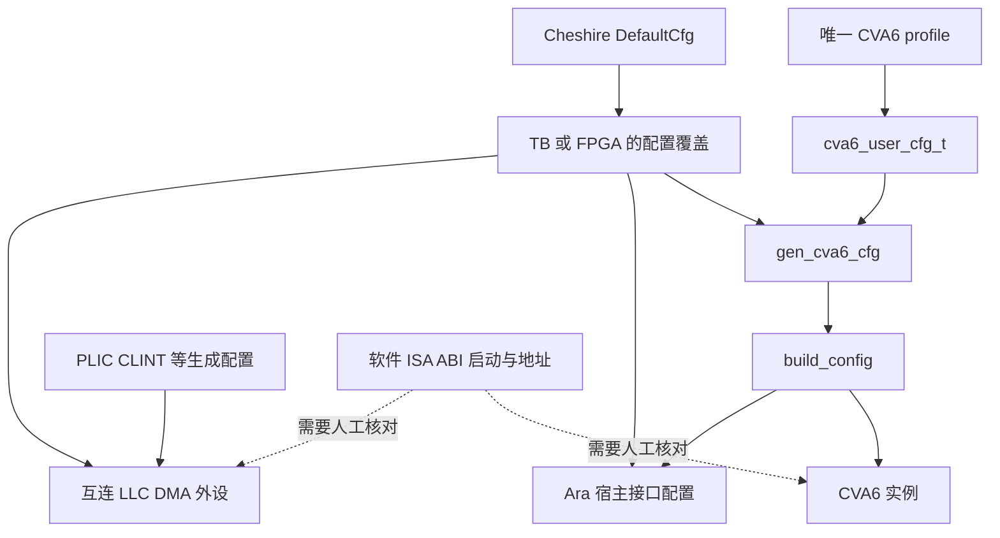

# Cheshire–CVA6–Ara 配置手册：阅读入口

本手册面向有 MIPS/自定义总线经验、正在学习 RISC-V/AXI 的团队，按“在哪里改、参数是什么意思、实际值是多少、哪些地方要一起改”组织。

整理日期：2026-09-20；任务：L01 配置学习文档；源码基准：本仓库 HEAD `379ae4544bc62e05a2736b11b33a3244181bba38`，含版本管理中的 `.bender/` 本地依赖快照。**本轮只做源码与文档静态检查，未编译、仿真、综合或板测。** 用户此前报告的 VCU118 HelloWorld 不扩展解释成 Ara/DDR 全功能已验证。

## 1. 建议阅读顺序

| 文档 | 解决的问题 | 覆盖范围 |
| --- | --- | --- |
| [常用配置与修改流程](RECIPES.md) | 当前到底用哪组配置？第一次怎么改？ | 仿真/FPGA/软件入口、配置矩阵、示例、核对表 |
| [CVA6 参数](CVA6.md) | CPU profile、ISA、cache、MMU、PMP 怎么配？ | 当前 cva6_user_cfg_t 全部 88 字段，覆盖关系与关键派生量 |
| [Cheshire SoC 参数](CHESHIRE.md) | 总线、地址、外设开关、LLC、外部接口怎么配？ | 当前 cheshire_cfg_t 全部 113 字段、默认值、地址图、容量公式 |
| [Ara 参数](ARA.md) | lanes、VLEN、浮点、访存带宽怎么配？ | 顶层参数、固定实例参数、包常量、现有 lane 示例 |
| [其他模块与平台参数](PERIPHERALS.md) | DMA、外设、生成包、DDR wrapper、VIP 怎么配？ | 当前集成相关参数与运行时入口、生成依赖和限制 |

这是一份当前本地版本的配置字典和使用指南。它没有逐个列出第三方 IP 所有内部参数，也没有把未验证的自由组合写成受支持产品配置。若以后更换依赖版本，应重新对照结构体和实例，而不是直接照抄旧表。

## 2. 先分清五种“配置”

| 层次 | 例子 | 何时生效 | 误区 |
| --- | --- | --- | --- |
| 源文件/profile 选择 | cv64a6_imafdcv_sv39_config_pkg.sv | 编译源码时 | SELCFG 不会切换已编译的 CPU profile |
| 宏 | ARA、NR_LANES、VLEN、TARGET_VCU118 | 预处理时 | FPGA wrapper 读宏，当前 TB Ara 函数却写死 2/2048 |
| 硬件参数 | Cfg.Ara、Cfg.LlcSetAssoc、Cva6Cfg.RVV | 展开/综合时 | 运行软件无法增加 lane 或扩容 SRAM |
| 生成参数 | PLIC src/target、CLINTCORES、SerialLink NumBits | 生成寄存器 RTL/头文件时 | 改 SoC 字段不自动重生成 IP |
| 软件与运行时 | -march/-mabi、VS/FS、DMA 长度、LLC SPM way | 软件构建/运行时 | 编译器能生成指令不表示硬件已经支持 |

`parameter` 是实例化时传入的硬件配置；`localparam` 通常由其他参数计算或由实现固定；`typedef struct packed` 把许多配置打包成一个可传递对象。`DefaultCfg` 是起点，函数先复制再覆盖部分字段。模块声明的 `Cfg='0` 或 `parameter ...=0` 常是占位，不是可工作的推荐实例。

## 3. 当前工程先记住的数值

以下是**向量 profile + TB Ara 配置**的静态取值快照，尚不能当成当前标量仿真脚本已经使用的组合：

| 项目 | 值 |
| --- | --- |
| CPU profile / core 数 | cv64a6_imafdcv_sv39 / 1 |
| CPU XLEN / CPU VLEN / Sv 模式 | 64 / 64 / Sv39 |
| CPU I-cache / D-cache | 4 KiB / 8 KiB WT |
| Ara | 开启，2 lanes，向量 VLEN=2048 bit |
| SoC AXI 地址/数据/USER | 48/64/2 bit |
| CPU AXI ID / xbar 输入 ID / LLC 下游 ID | 4/2/6 bit |
| LLC 阵列 / Boot ROM 初始化用途 | 128 KiB / 全部先设为 SPM |
| DMA | 2D 前端，任务 FIFO=2，在途 AXI=16 |
| RTC 信息 | TB 32768 Hz；FPGA wrapper 1000000 Hz |
| PLIC 源/context、CLINT 核数 | 58/2、1 |

## 4. 最容易造成返工的联动

1. 向量能力要同时对齐 CPU profile、Ara 开关、真实 decoder、软件 ISA 和 VS/FS 初始化。
2. `Cva6NrPMPEntries=0` 覆盖 CPU profile 的 8；profile 名含 sclic 也会被 SoC Clic=0 关闭。
3. CPU 的 VLEN 是地址容器，Ara 的 VLEN 是向量寄存器长度，不能一起改成 2048。
4. LLC 与启动 SPM 共用阵列；删 LLC 会影响 Boot ROM、栈和链接脚本。
5. AXI master 数变化会影响 ID 位宽、AXI RT 生成尺寸、原子来源标识与下游适配。
6. NPU/ISP 接入外部 AXI master 端口不自动绕过 LLC，也不自动获得一致性。
7. FPGA IO 宏、SoC 模块存在与板上测试是三个独立事实。
8. 本地未提交文档与 `.bender/` 依赖应保留，配置学习不需要清依赖或升级版本。

## 5. 证据与维护

本手册依据仓库内源码，不依赖最新版网络文档推断本地行为。每章链接到具体定义/消费者。表中区分 profile 原值、SoC 覆盖值、派生值与建议；以当前代码和可追溯测试为准。

本轮发现的消费者差异与待核查项集中在 [修改流程的已知缺口](RECIPES.md#6-本轮静态发现与待验证项)，包括仿真 profile/decoder、Serial Link 分频字段、SPM 执行属性、DMA 1D busy、VGA 错误追踪容量。没有顺手修改 RTL。

项目目标与边界见 [PROJECT_STATE](../PROJECT_STATE.md)、[AGENT_TASKS](../AGENT_TASKS.md) 和 [ASIC 提取交接书](../02_Cheshire_Ara_ASIC_Extraction_Handoff.md)。本轮验证与交接见 [L01 记录](../handoffs/2026-09-20_L01_configuration_reference.md)。
