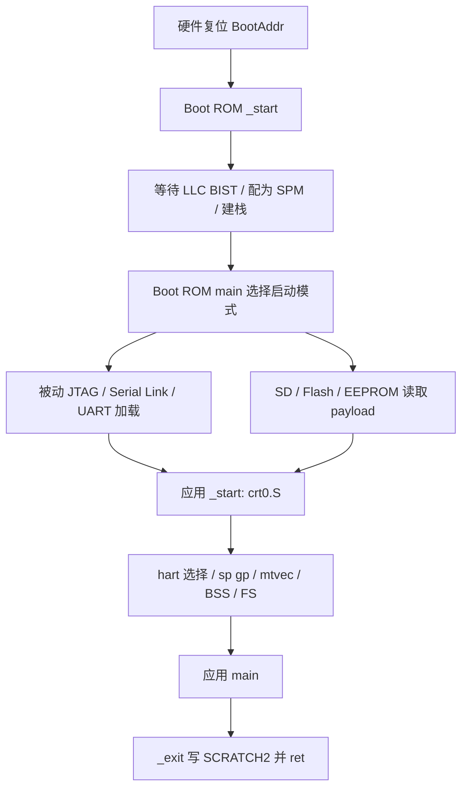

# 链接、启动、程序加载与调试

返回 [软件导航](README.md)。来源：[链接目录](../../sw/link)、[应用 crt0](../../sw/lib/crt0.S)、[Boot ROM 汇编](../../hw/bootrom/cheshire_bootrom.S)、[Boot ROM C](../../hw/bootrom/cheshire_bootrom.c)。

## 1. 程序产物的用途

| 格式 | 保留什么 | 用在哪里 |
| --- | --- | --- |
| .o | 可重定位代码/数据/符号，可能含 LTO 中间表示 | 链接输入，不能直接运行 |
| .a | 多个 .o 的归档 | 按需抽取符号实现，没有独立入口 |
| .elf | 入口、段地址、符号、可选调试信息 | loader/GDB/反汇编，最适合初期调试 |
| .dump | objdump -d -S 文本 | 查实际指令与源码对应；不是可加载镜像 |
| .bin | 连续裸字节 | 必须另外知道加载地址/布局；不含 ELF 符号 |
| .memh | objcopy 的 Verilog hex 文本 | 给指定存储模型；地址语义要与模型一致 |
| .dtb | 编译后的设备树 | 描述系统，不能替代可执行代码 |
| .gpt.bin | 分区表和多个 payload 的磁盘镜像 | 外部介质自主启动 |

`.spm/.dram/.rom` 表示链接模式，`.elf/.bin/.dump` 表示格式，两个后缀解决不同问题。

<a id="2-链接器怎样安排程序"></a>

## 2. 链接布局与存储分配

| section / 符号 | 当前用途 |
| --- | --- |
| .text._start | 首个入口代码；ENTRY(_start) 指向它 |
| .text / .text.* | 函数机器码 |
| .misc | 本脚本收集 rodata/data/sdata 等，不是只有只读内容 |
| .bss / .sbss | 零初始化对象；由 crt0 清零，无须在镜像中放满零 |
| .bulk | 项目自定义大块数据 section |
| __global_pointer$ | gp 的目标，由 .misc 位置计算 |
| __stack_pointer$ | 0 表示继承调用者栈；非 0 表示切换到指定栈 |
| __bss_start / __bss_end | 清零区边界 |
| __base_uart 等 | 链接器赋值的地址符号，供 MMIO 使用 |

`params.h` 将地址符号声明为 `extern void *__base_uart`，调用写作 `&__base_uart`。这里使用符号地址，不是去该地址先读出一个“指针变量”；不要把 `uart_init(&__base_uart,…)` 改成 `uart_init(__base_uart,…)`。

### 2.1 三种链接模式

| 模式 | 运行地址 VMA | 装载地址 LMA | 栈 | 适合用途 |
| --- | --- | --- | --- | --- |
| spm.ld | SPM 0x10000000 起 | 同运行区 | 继承已初始化 Boot ROM 栈 | 小程序、DMA SPM 别名实验 |
| dram.ld | DDR 0x80000000 起 | 同运行区 | 0x80800000−8 | 大数据/模型；须 DDR 可用 |
| rom.ld | SPM 0x10000000 起 | extrom 偏移 0 起 | 继承调用者栈 | 制作供 Boot ROM 读取并搬到 SPM 的连续 payload |

`common.ldh` 的区域长度：bootrom=16 KiB、extrom=48 KiB、spm=64 KiB、dram=8 MiB。它们是当前软件链接预算，既不等于所有硬件译码窗口，也不证明 DDR 已测试这些容量。默认硬件 LLC/SPM 总阵列 128 KiB，链接器仍按 64 KiB 安排 SPM 应用。

`rom.ld` 把所有需加载内容合并到 `.misc > spm AT>extrom`，BSS 仍在 SPM。这不是“应用直接在地址 0 执行”，也不是“替换 FPGA 内置 Boot ROM”。不同 loader 可能依据 ELF 的物理/虚拟地址加载，不能未经核对拿 `.rom.elf` 当普通 `.spm.elf` 直载。

当前 crt0 没有通用 `.data` 从 ROM LMA 复制到 RAM VMA 的循环；它依赖 loader/Boot ROM 已把可加载内容放到运行位置。新加 `.data AT>flash` 后需要另补搬运机制，不能只改链接脚本。

<a id="22-如何检查链接结果"></a>

### 2.2 链接结果检查

```sh
riscv64-unknown-elf-readelf -h -l sw/tests/helloworld.spm.elf
riscv64-unknown-elf-objdump -h sw/tests/helloworld.spm.elf
riscv64-unknown-elf-nm -n sw/tests/helloworld.spm.elf
```

看入口、LOAD 段、VMA/LMA、文件大小和内存大小；再看 map 中的 `.bss/.misc/.text` 与栈是否冲突。`size` 显示的 bss 不占镜像字节但占运行 RAM。heap、stack 不会因为“还有地址空间”就自动被本 SDK 管理。

<a id="3-从上电到-main-的两级初始化"></a>

## 3. Boot ROM 与应用的两级初始化



Boot ROM 首先建立片上存储和调用环境。被动模式等待 loader；自主模式通过 HAL 读介质，可按 GPT 找 payload，也可读 raw 内容。启动模式 0/1/2/3 分别为被动/SPI SD/SPI Flash/I2C EEPROM。

应用 crt0 的实际顺序：

1. 关闭 M/S 全局中断；非 hart0 进入 wfi 循环。存在 SMP 头不表示普通 C 应用已经并行运行。
2. 保存进入时的 sp；若 `__stack_pointer$!=0` 切换栈，设置 gp；栈上保存 sp/gp/ra 供返回使用。
3. 把 mtvec 指向 `_trap_handler_wrap`。
4. 清 `__bss_start` 到 `__bss_end`；不搬 `.data`。
5. 设置 FS，初始化 32 个双精度浮点寄存器，再将 FS 调到 Clean。
6. fence 后调用 main。
7. main 返回时，恢复保存的寄存器，编码返回值并写 SCRATCH2，然后 `ret`。

因此现有 crt0 **本身执行 D 扩展指令**；即便 C 程序只做整数加法，也不能原样拿它配无浮点 CPU。crt0 没有统一设置 VS，RVV 应用在第一条向量指令前单独设置。

当前不是通用 libc/RTOS 启动框架：未见 C++ 全局构造调用、完整线程调度、浮点/向量任务上下文切换或 heap 系统调用适配。需要这些功能时应另建运行时契约。

<a id="4-退出码异常和卡住"></a>

## 4. 退出码、异常与运行停顿

`_exit` 写入地址 `0x03000008`（SCRATCH2）的值为 `(main返回值<<1)|1`。bit0 表示程序已结束；其余位承载返回码。0 返回通常编码为 1。默认弱 `trap_vector` 是自循环，异常发生后程序可能没有任何串口输出，也不会走正常结束协议。

`_trap_handler_wrap` 保存整数 caller-save 寄存器，调用可覆盖的 `trap_vector`，恢复后 mret；它没有保存浮点/向量寄存器。处理器会在返回后重新执行 mepc 处指令，异常 handler 若不修正原因或按指令长度调整 mepc，可能重复陷入。含 RVC 时不能无条件 `mepc+=4`。

| 现象 | 优先检查 |
| --- | --- |
| 没串口、PC 在 trap_vector | mcause、mepc、mtval；反汇编出错指令、ISA/FS/VS |
| 卡在 clint_get_core_freq | RTC 是否在跳变，参考频率配置是否正确 |
| 卡在 uart_write/flush | UART 使能、时钟、引脚与状态寄存器 |
| 卡在 DMA DONE_ID | 硬件 DMA、地址可达、任务是否提交、AXI RT 隔离/错误响应 |
| main 返回但 GDB 不停止 | 没有 OS exit；观察 _exit/SCRATCH2 或设明确断点 |
| 软件输出 PASS，但不能回归确认 | 检查是否所有失败分支均返回非零；见矩阵乘测试 |

常用 GDB 观察命令：`info registers`、`p/x $mepc`、`p/x $mcause`、`p/x $mtval`、`x/8i $pc`、`x/wx 0x03000008`。寄存器名是否可用取决于本机 GDB/OpenOCD 组合，必要时用已知 CSR 访问机制；本轮未连接确认。

## 5. 仿真加载

来源：[TB](../../target/sim/src/tb_cheshire_soc.sv)、[VIP](../../target/sim/src/vip_cheshire_soc.sv)、[Questa 入口](../../target/sim/vsim/start.cheshire_soc.tcl)。先用匹配清单编译 RTL/ELF loader，再加载已匹配的 ELF。

| 参数 | 用法 |
| --- | --- |
| SELCFG=0 | DefaultCfg，适合普通标量/默认 DMA |
| SELCFG=1 | AXI RT 配置，Ara 仍关闭 |
| SELCFG=2 | CLIC 配置，CPU profile/生成包要匹配 |
| SELCFG=3 | Ara 2 lanes/2048 配置；还须向量 CPU profile 和正确 decoder 清单 |
| BOOTMODE=0 | 被动加载 |
| PRELMODE=0/1/2 | JTAG / Serial Link / UART |
| BINARY | ELF 路径 |
| IMAGE | Flash/EEPROM 模型镜像，不是 BINARY 的别名 |

在 `target/sim/vsim` 的示意用法（已有匹配的 work 库；本轮未运行）：

```tcl
set SELCFG 0
set BOOTMODE 0
set PRELMODE 0
set BINARY /absolute/path/to/helloworld.spm.elf
source start.cheshire_soc.tcl
run -all
```

测试返回码与进程退出状态分别记录，不把仿真器正常 `$finish` 等同于测试结果正确。当前 TB 对 `BOOTMODE=1` 明确报未支持；板级 SD 功能与仿真模型能力不同。当前 checkout 仿真清单的向量问题见 [配置矩阵](../configuration/RECIPES.md)。

## 6. FPGA 上的 JTAG、OpenOCD 与 GDB

先有已确认的 bitstream，再下载 ELF。`util/openocd.hs2.tcl` 配 Digilent HS2，当前 adapter speed=100；`openocd.genesys2.tcl` 使用另一套 FTDI 参数。文件名表示调试适配器/板级接线，不是通用的 VCU118 默认配置。

[公共脚本](../../util/openocd.common.tcl) 建立 IDCODE=0x1c5e5db3 的目标，`reset_config none`、`riscv set_prefer_sba off`，初始化后 halt；因此不能假定每次连接都会复位，或板级访存都通过 SBA。GDB detach 会关闭该 OpenOCD 服务。

主机启动示例，仅在确实使用 HS2 且连接已确认时采用：

```sh
openocd -f util/openocd.hs2.tcl
riscv64-unknown-elf-gdb sw/tests/helloworld.spm.elf
```

<a id="61-优先沿用-boot-rom-的调用协议"></a>

### 6.1 Boot ROM 调用协议与调试约束

必须先确认 Boot ROM 已完成 BIST/建栈，且 CPU 正处于被动等待阶段。不要在“刚复位、SPM 还没准备好”的位置直接跳入 SPM 程序。

被动启动源码 `boot_passive()` 真正使用：SCRATCH0/1 为 64 位入口的低/高 32 位，SCRATCH2 的 **bit1（掩码 2）** 为启动请求。旁边旧注释的 bit 编号不完全一致，以表达式为准。应用完成后同一 SCRATCH2 被写为结束码。

可据此设计 GDB 下载流程：halt 在已确认的等待点→保存等待 PC→load ELF→恢复等待 PC→填写入口低/高字→SCRATCH2=2→continue。恢复等待 PC 是为了避免 loader 改写 PC 后绕过 ROM 调用环境。具体示意（**仅适用于上述前置状态**）：

```gdb
target extended-remote localhost:3333
monitor halt
set $chs_boot_wait_pc = $pc
load
set $pc = $chs_boot_wait_pc
set $chs_app_entry = (unsigned long long)&_start
set {unsigned int}0x03000000 = (unsigned int)$chs_app_entry
set {unsigned int}0x03000004 = (unsigned int)($chs_app_entry >> 32)
set {unsigned int}0x03000008 = 2
break main
continue
```

此示例未连接板卡验证，优先保留团队已经板测的下载流程。`load` 写可加载段，不会烧录 FPGA；`file`/启动 GDB 带 ELF 只加载主机符号，不等于下载目标内存。单独 `set $pc=_start` 必须自行满足有效 sp/ra 等契约。

## 7. UART 与自主启动、ZSL

UART debug 是二进制协议，不是把 ELF 文件直接发给终端：ACK=0x06，READ/WRITE/EXEC=0x11/0x12/0x13，结束传输 EOT=0x04，执行返回 EOC=0x14；地址/长度用 64 位字段，EXEC 返回 32 位结果。实现见 [uart_debug.c](../../sw/lib/hal/uart_debug.c)，仿真 VIP 已有对应客户端；本轮未新增主机下载器。

自主启动时 Boot ROM 用器件 HAL 读取存储，GPT/raw loader 将初级代码搬到 SPM。`sw/boot/zsl.c` 再使用 ROM 留在 scratch 中的读取函数、私有参数及 gp，从介质加载 DTB 到 `0x80800000`、固件到 `0x80000000`，最终调用固件并传入 DTB 地址。ZSL 自身不是 Linux 内核，也不是普通用户应用。

[flash.c](../../sw/boot/flash.c) 是写介质的目标端程序；[flash_disk.gdb](../../util/flash_disk.gdb) 将镜像暂存 DDR，再通过 scratch 传参，目标 1/2/3 对应 SD/Flash/EEPROM。它会实际改写介质，需明确设备、范围和镜像。当前 [flash_disk.sh](../../util/flash_disk.sh) 的长度参数注释与换算表达式不完全一致，并且向上取整采用 `len/(256*1024)+1`，整倍数会多算一块；本手册不把它列为可无审查执行的一键命令。

<a id="8-新程序的最小约定"></a>

## 8. 新程序的运行与验证要求

新增 `name.spm.c` 适合小型 MMIO/库学习；新增 `name.dram.c` 用于已可用 DDR 上的大数据。原构建规则会自动收集它们。以已有 HelloWorld 的 UART 初始化为起点，先检查需要的硬件 feature，再执行算法并返回明确错误码，返回前 flush UART。

需要异常处理时提供自定义 `trap_vector`，先用整数代码保存/报告 CSR，不在未建立上下文保护时调用向量/浮点处理。需要 RTOS、malloc、文件 IO 或 C++ 时，先设计运行时适配，不能仅因为工具链带 libc/libstdc++ 就认为这些功能已经接好。
